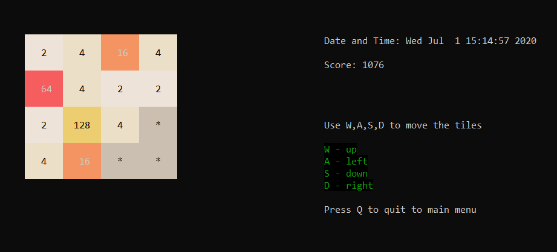
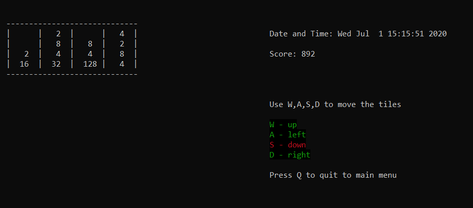

# 2048

The classic 2048 game implemented using C with the ncurses library.




### Controls

- W - up
- A - left
- S - down
- D - right

If a direction is marked with red then it means pressing that key will not affect the board in any way.

The game will automatically make a viable move after a certain amount of time.

### To install ncurses:

```
sudo apt-get install libncurses5-dev libncursesw5-dev
```

### Build

```
make
```

### Run the Game

```
make run
```

#### Note

When exiting the game, the colors in the terminal may suffer changes. Reload the terminal to get back the normal colors.
